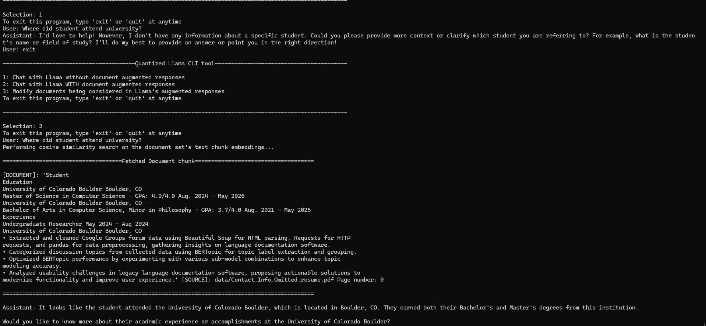

# Quantized-Llama-with-RAG

## Setup
    - In a bash terminal navigate to the root directory of this repository and run setup.sh (This will install the model, necessary python packages, and clone the llama.cpp repository)

## Instructions to run
    - Open two bash terminals, run "runServer.sh" in one
    - In the second bash terminal, first run 'runLoader.sh' and THEN run 'runCLI.sh' 
    - Running server.sh will open an http server that will host the model using llama.cpp.
    - Running runLoader.sh generates a json file of chunked and vectorized document information (THIS NEEDS TO BE RUN BEFORE THE FIRST RUN OF 'runCLI.sh')
    - Running runCLI.sh will open the command line interface for this project.

## Overview
    - Since this challenge had a hardware requirement to run a document augmented LLM on a laptop with no reference to ability to utilize the GPU, running the model using llama.cpp was the best choice.
    - Llama.cpp offers a fast CPU LLM inference because it implements multithreading and efficient memory access.
    - We can speed up llama.cpp's capabilities even more by using a 3 bit quantized Llama 3.2-3B model for our LLM. Since this model's weights need to be loaded into RAM while its running, its size is a huge factor in performance. The quantized llama model I chose sits at around 1.6 gb, this small model footprint, combined with highly optimized model inference for CPU using llama.cpp allows for reasonable query times with accurate responses.
    - Depending widely on hardware, most queries take < 10 seconds for llama to start responding, however, document augmented responses can take slightly longer (as there are more tokens in the input). This is when run on my laptop with an intel i7 and 16 gb of RAM. 

## RAG System
    - The retreival augmentation system I chose to adopt was relatively simple, as time searching document's only adds to the query time.
    - All documents must be PDF and put into the 'data' folder to be considered.
    - Documents are chunked using a text splitter from LangChain, I opted for a chunk size of 1000 with an overlap of 200.
    - After documents are chunked, the chunk is vectorized using a sentence transformer. This is done in a different python script than the CLI running the chatbot (I.E. You need to run 'runLoader.sh' again if you add a document to the 'data' folder)
        - This pre-loading was accomplished by simply converting the document data into one large json that can be read in quicker than rechunking and recomputing document embeddings each time (with larger numbers of documents, this would need to be changed to a more scalable approach).
    - The CLI will begin after loading libraries and the embedding model, allowing for the user to press 1 - To chat with llama WITHOUT document augmented responses, 2 - To chat with llama WITH document augmented responses.
    - Document augmented responses are done by first vectorizing the user's query to the model and doing an exhaustive search of document chunk embeddings to find the most similar chunk. The evaulation metric used here is cosine similarity.
    - I experimented with optimizing the exhaustive search by vectorizing the title of the document and greedily searching the 2 documents with the highest similarity scores to the users query, however, I found that documents with misleading or uninformative titles are often skipped over when they most likely contain the most similar chunks of information. Given that the vector search is fast for a small set of documents (since most of the computation is in chunking and vectorizing (not searching)), I opted to keep things simple. 
    - Once the vector search is complete, the fetched document chunk is then appended to the user's query such that the model can augment its response using the information fetched from the vector search, the fetched chunk is also output prior to the model's response so that the user can view what part of the document is being used.

## Example Usage
    - 
